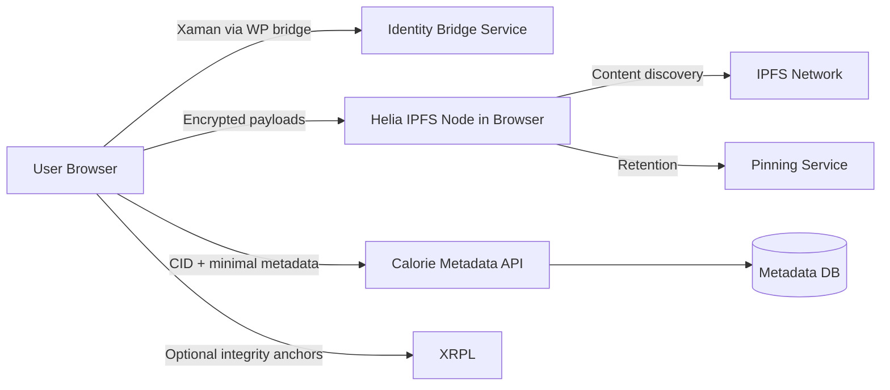

# CALORIEAPP - DECENTRALIZED ARCHITECTURE RESEARCH & DESIGN v1

Status: Research-only architecture document. No runtime code changes.

## Evidence Method

This document uses explicit evidence labels:

- REPO-EVIDENCE: claims verified from this repository.
- EXTERNAL-EVIDENCE: claims verified from published documentation.
- UNKNOWN - REQUIRES VERIFICATION: unresolved items needing platform, legal, or benchmark validation.

---

## 1. Executive Summary

CalorieApp today is a centralized web app with a FastAPI backend, SQLite persistence, and a Next.js frontend that uses credentialed cookies for authenticated food logging. Authentication is bridged through WordPress + XUMM/Xaman identity flow. There is no implemented IPFS/Helia/BigchainDB runtime layer in code.

REPO-EVIDENCE:
- V1 scope explicitly forbids blockchain, wallet, token, or financial logic: README.md:16, backend/README.md:9
- Backend is FastAPI + SQLModel + SQLite defaults: backend/app/main.py:1, backend/app/database.py:1-21
- Auth endpoints and food endpoints are centralized backend APIs: backend/app/main.py:189-458
- Frontend uses backend HTTP with credentials include: frontend/components/XamanLoginPanel.tsx:32-93, frontend/app/auth/callback/page.tsx:38-44, frontend/components/FoodSearchPlaceholder.tsx:176-426

Recommendation at a glance:
- Adopt a Hybrid Browser-First model for future phases (not V1 implementation):
  - Encrypt nutrition/user artifacts client-side using Web Crypto.
  - Store encrypted payloads to IPFS via Helia + managed pinning service.
  - Keep minimal centralized metadata/index and identity bridge services.
  - Anchor content integrity proofs (hash/CID references) on XRPL only where required.
- Reject BigchainDB for primary architecture due to weak maintenance/activity signals and additional ops burden.

EXTERNAL-EVIDENCE:
- Helia is browser-focused IPFS implementation in TypeScript: https://github.com/ipfs/helia
- IPFS does not guarantee persistent availability without pinning/retention strategy: https://docs.ipfs.tech/concepts/persistence/
- Web Crypto is low-level and secure-context constrained; key lifecycle is non-trivial: https://developer.mozilla.org/en-US/docs/Web/API/Web_Crypto_API and https://www.w3.org/TR/WebCryptoAPI/
- XRPL supports transaction Memos (up to 1 KB serialized for Memos field) and submit best practices (submit signed tx_blob, avoid exposing secrets): https://xrpl.org/docs/references/protocol/transactions/common-fields and https://xrpl.org/docs/references/http-websocket-apis/public-api-methods/transaction-methods/submit
- BigchainDB public release/activity appears old (latest release shown as 2020; latest commit shown as ~4 years): https://github.com/bigchaindb/bigchaindb and https://github.com/bigchaindb/bigchaindb/releases

---

## 2. Current Architecture (As-Is)

### 2.1 Backend

- FastAPI app with CORS and cookie-authenticated identity and food log endpoints.
- Identity flow includes:
  - POST /api/identity/login/start
  - POST /api/identity/login/state/validate
  - POST /api/identity/callback
  - GET /api/identity/me
  - POST /api/identity/logout
- Food flow includes:
  - GET /search-food (Open Food Facts upstream)
  - POST /log-food
  - GET /logs
  - DELETE /logs/{log_id}
  - DELETE /logs

REPO-EVIDENCE:
- Endpoint definitions: backend/app/main.py:179-458
- Open Food Facts integration layer: backend/app/services/open_food_facts.py:19-206

### 2.2 Data Model

- Tables include:
  - calorieappuser
  - externalidentity
  - authorizationcode
  - pendingloginstate
  - food_log
- SQLite default with local db path and optional column backfills.

REPO-EVIDENCE:
- Models: backend/app/models.py:14-99
- SQLite config and engine: backend/app/database.py:11-21

### 2.3 Frontend

- Next.js UI calls backend APIs via fetch with credentials include.
- Callback route finalizes auth by posting code/state to backend.

REPO-EVIDENCE:
- Auth panel fetches: frontend/components/XamanLoginPanel.tsx:32-93
- Callback flow: frontend/app/auth/callback/page.tsx:38-55
- Food search/log API calls: frontend/components/FoodSearchPlaceholder.tsx:176-426

### 2.4 Scope Constraints

- Current governance: non-financial food tracking app, no active blockchain/wallet/token runtime in V1.

REPO-EVIDENCE:
- README scope: README.md:3-16
- Backend README scope: backend/README.md:3-10
- Architecture roadmap marks XRPL/IPFS/BigchainDB as future phases: docs/architecture.md:18-20, docs/roadmap.md:28-45

---

## 3. Target Architecture (To-Be, Future Phase Design)

### 3.1 Design Goal

Preserve current user experience while reducing central data custody for nutrition artifacts and improving verifiability.

### 3.2 Proposed Hybrid Browser-First Topology

Principles:
- Browser handles encryption and content creation.
- Server stores minimal searchable metadata and access policy state, not plaintext nutrition payloads.
- IPFS stores encrypted blobs referenced by CID.
- XRPL records compact proofs/references only when audit requirements justify cost.

---

## 4. Helia/IPFS Feasibility

### 4.1 What Works

- Helia supports browser and JS environments and modular data APIs (strings/json/dag formats).
- IPFS content addressing is suitable for immutable content identification.

EXTERNAL-EVIDENCE:
- Helia browser-oriented statement and examples: https://github.com/ipfs/helia
- IPFS content-addressed protocol definition: https://docs.ipfs.tech/concepts/what-is-ipfs/

### 4.2 Critical Constraints

- IPFS alone does not guarantee permanence/availability.
- Persistence requires pinning strategy and funding.
- If only one sponsor pins content, durability depends on that sponsor continuing to pay/operate.

EXTERNAL-EVIDENCE:
- Persistence/pinning caveats: https://docs.ipfs.tech/concepts/persistence/

### 4.3 Implication for CalorieApp

- Must include retention policy + at least one managed pinning provider.
- Should maintain re-pin/repair jobs for high-value records.
- Should define data class tiers:
  - hot data (active logs)
  - warm data (history)
  - cold/audit snapshots

---

## 5. Encryption and Key Management

### 5.1 Recommended Crypto Pattern

- Generate per-user root key material client-side.
- Derive per-record data encryption keys (DEKs) via HKDF.
- Encrypt record payload with AES-GCM.
- Encrypt DEK for recovery/share paths as needed.

### 5.2 Web Crypto Realities

- Web Crypto is available in secure contexts and workers.
- API is low-level and easy to misuse.
- Key persistence and lifecycle depend on web storage and origin boundaries.
- Users clearing storage can lose keys unless recovery is designed.

EXTERNAL-EVIDENCE:
- Secure-context requirement and caution: https://developer.mozilla.org/en-US/docs/Web/API/Web_Crypto_API
- Spec details on key storage/author security caveats: https://www.w3.org/TR/WebCryptoAPI/

### 5.3 Key Recovery Strategy (Proposed)

- Default: device-local keys for privacy-first mode.
- Optional: user-controlled recovery package (encrypted export).
- Enterprise mode: bring-your-own-KMS or delegated escrow.

UNKNOWN - REQUIRES VERIFICATION:
- Product decision on acceptable recovery UX vs maximal privacy.
- Compliance constraints for key escrow by jurisdiction.

---

## 6. Identity and Xaman/XUMM Integration Role

- Keep current WordPress + bridge pattern for identity continuity.
- Do not route signing secrets through centralized backend.
- Use identity only for session/authz and metadata ownership mapping.

REPO-EVIDENCE:
- Bridge auth and exchange flow implemented centrally: backend/app/main.py:46-176, 189-324
- Identity mapping models exist: backend/app/models.py:35-99

EXTERNAL-EVIDENCE:
- XRPL submit guidance recommends submitting signed transactions and warns against exposing secrets in sign-and-submit contexts: https://xrpl.org/docs/references/http-websocket-apis/public-api-methods/transaction-methods/submit

---

## 7. CalorieDB Concept (Decentralized-Aware Data Layer)

Define CalorieDB as logical, not single product:

- Encrypted Object Store (IPFS CIDs -> encrypted payloads)
- Metadata Index (central API DB):
  - owner user id
  - cid
  - schema version
  - timestamps
  - tags/nutri summary fields (optionally encrypted index tokens)
- Optional Integrity Anchor Log:
  - cid/hash references
  - timestamp
  - signer identity reference

This keeps search/product UX possible while minimizing centralized custody of sensitive payload content.

---

## 8. BigchainDB Evaluation and Decision

### 8.1 Fit Assessment

Pros:
- Immutable/audit narrative aligns with append-only event requirements.

Cons:
- Additional distributed system complexity (ops, monitoring, upgrade path).
- Overlap with lighter alternatives (IPFS CID + XRPL anchor + central metadata log).
- Public maintenance signals appear weak/stale for risk-sensitive platform dependency.

EXTERNAL-EVIDENCE:
- Repo latest release visible as Sep 2020 (v2.2.2) and low recent activity indicators: https://github.com/bigchaindb/bigchaindb and https://github.com/bigchaindb/bigchaindb/releases

### 8.2 Decision

Decision: Do not adopt BigchainDB as core architecture in this phase.

Use instead:
- IPFS for content addressing/storage
- Optional XRPL anchors for public verifiability
- Central metadata/index + internal append-only audit log for operations

---

## 9. XRPL Role in Final Architecture

### 9.1 Recommended Role

- Integrity anchoring only (hash/CID references, compact metadata).
- No tokenization, balances, payments, or financial workflows in this product scope.

### 9.2 Data Placement Guidance

- On-chain:
  - hash/CID references
  - minimal audit marker metadata
- Off-chain:
  - encrypted payloads
  - private user nutrition records
  - full audit event payloads

### 9.3 Constraint

- Memos are limited and should carry compact references, not full documents.

EXTERNAL-EVIDENCE:
- Memos field constraints and structure: https://xrpl.org/docs/references/protocol/transactions/common-fields

---

## 10. GDPR/Privacy Position

- Prefer storing personal nutrition payload encrypted and off-chain.
- Avoid writing personal data directly to immutable public ledgers.
- Use selective deletion at metadata/index layers and key revocation patterns for practical erasure posture.

UNKNOWN - REQUIRES VERIFICATION:
- Legal interpretation for encrypted-but-persistent blobs under specific jurisdictions.
- Data controller/processor model if third-party pinning is used.

---

## 11. Offline-First Strategy

### 11.1 Client Behavior

- Queue events locally when offline.
- Encrypt first, then persist to local IndexedDB cache.
- Sync when connectivity returns:
  - publish to IPFS
  - register metadata in central index
  - optionally anchor high-value checkpoints on XRPL

### 11.2 Conflict Strategy

- Event-sourced log entries with deterministic conflict resolution:
  - last-write-wins for mutable user preferences
  - append-only semantics for food log entries

UNKNOWN - REQUIRES VERIFICATION:
- Mobile browser storage quotas and eviction behavior under realistic usage.

---

## 12. Minimal Centralized Services (Required)

Even in browser-first decentralization, the following centralized services remain necessary:

1. Identity bridge/session service.
2. Metadata index/search service.
3. Access control and abuse prevention service (rate limit, policy).
4. Background retention monitoring (pin verification/repair).

REPO-EVIDENCE:
- Existing app already depends on centralized identity/session and API flows: backend/app/main.py:189-458, frontend/components/XamanLoginPanel.tsx:32-93

---

## 13. Threat Model (High-Level)

Primary threats:

1. Key loss in browser storage.
   - Mitigation: optional recovery package, multi-device key sync model.
2. Malicious script/XSS exfiltrating decrypted content.
   - Mitigation: strict CSP, dependency control, isolated sensitive flows, security reviews.
3. Pinning provider outage or attrition.
   - Mitigation: multi-provider replication and periodic retrieval audits.
4. Metadata correlation/privacy leakage.
   - Mitigation: minimize plaintext metadata, tokenize/encrypt selective fields.
5. Replay/abuse in anchor submission.
   - Mitigation: nonce, idempotency keys, signed client attestations.

---

## 14. Cost Model (Relative)

Cost buckets:

- Central API/DB hosting: low to medium (depends on traffic).
- Pinning service: medium and scales with retention volume.
- XRPL anchoring: low per event but accumulates with anchor frequency.
- Security/compliance operations: medium to high for production maturity.

Optimization levers:

- Anchor batching windows.
- Multi-tier retention policy.
- Differential replication by data criticality.

UNKNOWN - REQUIRES VERIFICATION:
- Exact monthly TCO requires projected daily active users, average records/user/day, and retention SLA.

---

## 15. Migration Roadmap

### Phase M0 - Baseline Hardening

- Keep current centralized architecture.
- Add explicit data classification and schema versioning.
- Add telemetry for storage volume, sync timings, and failure reasons.

### Phase M1 - Client Encryption + Local Queue

- Encrypt log payloads in client before submission.
- Persist encrypted queue offline.
- Keep centralized API as source of truth during transition.

### Phase M2 - IPFS Storage Path

- Publish encrypted blobs to IPFS via Helia.
- Save CID references in central metadata index.
- Introduce pinning service integration and health checks.

### Phase M3 - Optional Integrity Anchors

- Anchor batched CID/hash manifests on XRPL.
- Add verification endpoint/tooling.

### Phase M4 - Search/Index Optimization

- Introduce privacy-aware index strategies for discoverability.
- Minimize metadata leakage while preserving UX.

---

## 16. Proof of Concept Plan

POC objective: validate browser-first encrypted IPFS flow without breaking existing auth and food logging UX.

POC success criteria:

1. Encrypt/decrypt round-trip in browser with Web Crypto.
2. Store/retrieve encrypted payload by CID using Helia path.
3. Pin retention verification over 7-day window.
4. Metadata index lookup returns expected records.
5. Optional XRPL anchor flow validates CID manifest integrity.

POC non-goals:

- Full legal/compliance sign-off.
- Full mobile production hardening.

---

## 17. Architecture Decision Matrix

Scoring scale: 1 (poor) to 5 (strong)

| Option | Privacy | Durability | Complexity | Cost Predictability | UX Risk | Total |
|---|---:|---:|---:|---:|---:|---:|
| A. Centralized DB only | 2 | 3 | 5 | 5 | 5 | 20 |
| B. Hybrid encrypted + IPFS + metadata index | 4 | 4 | 3 | 3 | 4 | 18 |
| C. Fully decentralized everything | 5 | 3 | 1 | 2 | 2 | 13 |
| D. BigchainDB-centric immutable backend | 3 | 4 | 1 | 2 | 3 | 13 |

Interpretation:
- Option A is easiest but least aligned with decentralization goals.
- Option B is the best balance for this product shape.
- Option C and D carry substantial delivery risk and operational burden.

---

## 18. Render Decision

Current repository has no Render-specific deployment configuration and documents Vercel/Railway style patterns for staging references.

REPO-EVIDENCE:
- Deployment planning references Vercel/Railway patterns and notes no repo-native deployment automation: docs/STAGING_DEPLOYMENT_PLAN.md:31-38

Decision:
- Keep hosting platform choice provider-agnostic for decentralized architecture.
- Do not make Render a hard architectural dependency.
- Select platform later based on:
  - regional latency
  - secret management maturity
  - background job support
  - predictable egress/storage pricing

UNKNOWN - REQUIRES VERIFICATION:
- Final platform benchmarking under expected production load.

---

## 19. Final Architecture (Recommended)

Recommended target: Option B (Hybrid Browser-First Decentralized).

Core characteristics:

1. Identity remains centralized bridge-based (current pattern).
2. Nutrition payloads encrypted client-side by default.
3. Encrypted payloads stored in IPFS/Helia path with managed pinning.
4. Central metadata index retained for UX, policy, and interoperability.
5. Optional XRPL anchoring for integrity attestations only.
6. BigchainDB excluded from core stack.

Why this is practical:
- Preserves current frontend/backend contract and auth UX.
- Increases user-data minimization on central servers.
- Adds verifiability without forcing full-chain storage.
- Avoids introducing a high-risk stagnant dependency.

---

## 20. Residual Risks

1. Client key management remains the hardest product/security challenge.
2. Browser storage volatility can impact recovery and trust.
3. Pinning economics and vendor durability need continuous governance.
4. Metadata side-channels may still leak behavioral patterns.
5. Team operational maturity must grow for decentralized observability and incident response.

---

## 21. Final Recommendation

Proceed with a staged migration to Hybrid Browser-First Decentralized architecture (Option B), with strict guardrails:

1. Keep V1 centralized runtime stable while introducing client encryption first.
2. Add IPFS/Helia as encrypted object layer only after retention monitoring is in place.
3. Use XRPL anchors only for compact integrity attestations where audit value exists.
4. Do not adopt BigchainDB as a primary dependency.
5. Gate each phase by measurable reliability and security criteria before expansion.

---

## 22. Open Questions

1. What is the required retention SLA per data class (user logs vs audit snapshots)?
2. Which jurisdictions/users require strict deletion guarantees beyond key revocation patterns?
3. Is cross-device key portability mandatory at launch, or a later milestone?
4. What anchor cadence is acceptable for cost vs audit freshness (hourly/daily/weekly)?
5. Should metadata search fields be plaintext, tokenized, or encrypted indexes by default?
6. Which pinning provider redundancy model is acceptable (single, dual, or geo-triple)?
7. What is the minimum acceptable offline window and sync conflict policy for mobile web clients?

---

ARCHITECTURE RESEARCH COMPLETE.
